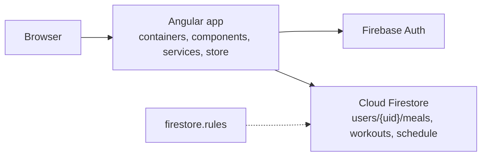

# Firestore Angular example

A meal and workout planner with a weekly schedule. Cloud Firestore is the reactive backend and Angular is the client. There is no server of our own: the browser talks to Firebase Authentication and Firestore directly, and `firestore.rules` keeps each user's data private.

License: MIT · Hosted at [fir-example-app-5c3d3.web.app](https://fir-example-app-5c3d3.web.app)

**Today:** `master` runs Angular 22.0.5 with `@angular/fire` 20.0.1 and the Firebase JS SDK. On Node 24.20.0, `npm ci` installs the tree, `npm run lint` reports 0 errors and 12 warnings, `npm run build` writes `dist/firebase-example-app/browser`, and `npm test` passes 73 of 73 specs in ChromeHeadless. Components are standalone, and each feature loads lazily. A user registers with an email and a password, keeps lists of meals and workouts, and assigns them to the morning, lunch, evening, and snacks sections of any day. Every document lives under `users/{uid}`, and the rules allow access only to that uid. One Firebase SDK (12.15.0) is installed: `overrides` maps AngularFire's `firebase` onto the root version. `npm audit` reports 63 vulnerabilities, and no CI runs on pull requests. The [roadmap](docs/roadmap.md) fixes those in order.

## Current status

| Area | Status |
|---|---|
| Auth | Email and password register, login, logout. A signed-out user is sent to `/auth/login` |
| Meals and workouts | Create, edit, delete. Live lists from Firestore |
| Schedule | Week view, four sections per day, assign meals and workouts. Entries store names, not ids ([FAE-052](https://github.com/SDS37/firestore-angular-example/issues/106)) |
| Security rules | `firestore.rules` restricts `users/{userId}` and its `meals`, `workouts`, and `schedule` subcollections to that user; everything else is denied. Not tested yet ([FAE-042](https://github.com/SDS37/firestore-angular-example/issues/101)) |
| Unit tests | 73 specs, Karma and Jasmine. Moving to Vitest ([FAE-031](https://github.com/SDS37/firestore-angular-example/issues/95)) |
| Dependencies | Angular 22.0.5, one `firebase` (12.15.0). Angular 22.2 and the rest of the upgrades in [M2](https://github.com/SDS37/firestore-angular-example/issues/88) |
| PWA | Manifest and service worker are built; the service worker is not registered |
| CI and deploy | None. Manual deploy with `npm run deploy:firebase`. Automated in [M4](https://github.com/SDS37/firestore-angular-example/issues/98) |
| Documentation | Roadmap, Definition of Done, requirements, architecture, ADRs, standards. See [docs/](docs/README.md) |

## How it works



Containers call data services. Only the services and the auth guard talk to Firebase, through small wrappers in `src/app/utils/`. Each service builds its query from the signed-in user, so the query changes when the user does. Services put results in a small RxJS store that components read. [Architecture](docs/architecture.md) has the layers, routes, data model, and flows.

## Tech stack

| Layer | Technology |
|---|---|
| Client | Angular 22, Angular Material 22, RxJS 7.8, TypeScript 6.0 |
| Firebase access | `@angular/fire` 20, Firebase JS SDK 12 |
| Backend | Firebase Authentication (email and password), Cloud Firestore |
| Hosting | Firebase Hosting, Angular service worker build |
| Tests and lint | Karma and Jasmine, ESLint with angular-eslint and typescript-eslint |

## Repository structure

```
firestore-angular-example/
├── src/
│   ├── app/
│   │   ├── containers/app/      # root component
│   │   ├── components/app/      # header and nav
│   │   ├── models/              # Meal, Workout, ScheduleItem, ScheduleList, User
│   │   ├── modules/
│   │   │   ├── auth/            # login, register, guard, AuthService
│   │   │   ├── nav-options/     # meals, workouts, schedule, data services
│   │   │   └── not-found/
│   │   ├── app.config.ts        # router, animations, Firebase providers
│   │   ├── app.routes.ts        # root routes; features load lazily
│   │   ├── store/               # Store and State
│   │   ├── testing/             # Firebase spies for specs
│   │   └── utils/               # wrappers around every AngularFire call
│   ├── environments/            # Firebase web config
│   └── styles/
├── docs/
├── firebase.json                # hosting and Firestore config
├── firestore.rules
├── firestore.indexes.json
├── .firebaserc                  # project and hosting target
├── .nvmrc
└── package.json
```

## Documentation

- [Documentation index](docs/README.md)
- [Business requirements](docs/business-requirements.md)
- [Technical requirements](docs/technical-requirements.md)
- [Architecture](docs/architecture.md)
- [Architecture decision records](docs/architecture-decision-records.md)
- [Roadmap](docs/roadmap.md)
- [Definition of Done](docs/DoD.md)
- [Commits](docs/commits.md)
- Standards: [TypeScript](docs/standards/typescript.md), [Angular](docs/standards/angular.md), [RxJS](docs/standards/rxjs.md), [SCSS](docs/standards/scss.md), [Firestore rules](docs/standards/firestore-rules.md), [dependencies](docs/standards/dependencies.md)

## Prerequisites

- Node in the `engines` range of `package.json`: 22.22.3 or newer on 22, 24.15.0 or newer on 24, or 26 and later. `.nvmrc` names 22.22.3; Node 24.20.0 is also tested. On older Node, npm only warns, and the Angular CLI then refuses to run.
- [nvm](https://github.com/nvm-sh/nvm), or any Node version manager, to get that version. The install steps below use nvm.
- Google Chrome, for `npm test`.
- A Firebase project, only if you want your own data or your own deploy. The Firebase CLI comes with the dev dependencies as `npx firebase`.

## Install

From the repository root:

```
nvm install
npm ci
```

`nvm install` reads `.nvmrc`, installs that Node version if it is missing, and switches to it. `nvm use` alone fails when the version is not installed yet. nvm-windows does not read `.nvmrc`; there, run `nvm install 22.22.3` and `nvm use 22.22.3`.

`.npmrc` sets `legacy-peer-deps=true` until [FAE-020](https://github.com/SDS37/firestore-angular-example/issues/89). Use `npm ci`, not `npm install`, so the lockfile is respected.

## Run

```
npm start
```

Open `http://localhost:4200`. Register with any email and a password of six characters or more (Firebase Auth's minimum), then use Schedule, Meals, and Workouts from the nav bar.

`npm start` uses `src/environments/environment.ts`, which points at the same Firebase project as the hosted app. Accounts and data you create locally are real accounts and data in that project. To work against your own project, follow the next section.

## Use your own Firebase project

1. In the [Firebase console](https://console.firebase.google.com/), create a project.
2. **Authentication** → Sign-in method → enable **Email/Password**.
3. **Firestore Database** → create a database in production mode.
4. **Project settings** → Your apps → add a **Web** app and copy its config object.
5. Paste that object into `firebase` in both `src/environments/environment.ts` and `src/environments/environment.prod.ts`. The web config is public by design; access is controlled by the rules, not by hiding the key.
6. Point the CLI at the project and the hosting site:

   ```
   npx firebase login
   npx firebase use --add <project-id>
   npx firebase target:apply hosting firebase-example-app <site-id>
   ```

   The site id is usually the project id. This updates `.firebaserc`.
7. Deploy the rules before you use the app, so new data is protected from the start:

   ```
   npx firebase deploy --only firestore:rules
   ```

## Scripts

| Script | Does |
|---|---|
| `npm run ng -- <args>` | Runs the project's Angular CLI, for example `npm run ng -- version` |
| `npm start` | `ng serve` with the development configuration on `http://localhost:4200` |
| `npm run build` | `ng build` with the production configuration into `dist/firebase-example-app/browser` |
| `npm test` | `ng test` once, headless, in ChromeHeadless |
| `npm run lint` | ESLint over `src/**/*.ts` and `src/**/*.html` |
| `npm run verify` | `lint`, then `build`, then `test`. Run it before every PR |
| `npm run deploy:firebase` | `npm run build`, then `firebase deploy --only firestore:rules,hosting` |

## Test

```
npm test
```

Specs never reach Firebase: `src/app/testing/firebase-test-harness.ts` replaces the wrappers in `src/app/utils/` with spies. There are no rules tests and no end-to-end tests yet ([FAE-042](https://github.com/SDS37/firestore-angular-example/issues/101), [M7](https://github.com/SDS37/firestore-angular-example/issues/111)).

## Deploy

Requires `npx firebase login` and a project set up as above.

```
npm run deploy:firebase
```

`predeploy:firebase` runs `npm run build` first, so every deploy ships the current code. That deploys `dist/firebase-example-app/browser` to the hosting target `firebase-example-app` and `firestore.rules` to Firestore, together. Hosting rewrites every path to `/index.html`, so deep links work. Preview channels and deploy on merge come with [FAE-043](https://github.com/SDS37/firestore-angular-example/issues/102).

## Commit convention

Conventional Commits: `type(scope): message`. Types, scopes, and examples: [docs/commits.md](docs/commits.md).

```
fix(auth): clear every store key on logout
docs: add the architecture and decision records
```

## License

MIT. See [LICENSE](LICENSE).
