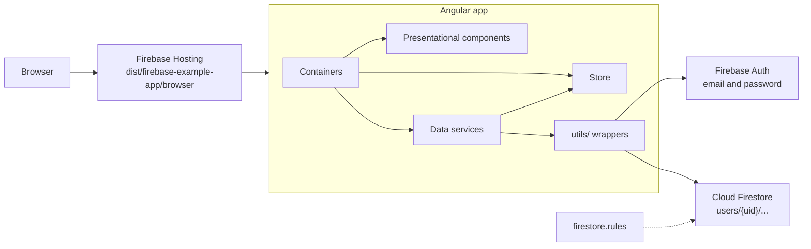

# Architecture

The app is an Angular single-page app that talks directly to Firebase Authentication and Cloud Firestore. There is no server of our own. Firebase Hosting serves the built files, and `firestore.rules` is the only thing between one user and another user's data.

**Today:** this describes `master` at the NgModule layout. [#57](https://github.com/SDS37/firestore-angular-example/pull/57) moves it to standalone components; when it merges, the module names below change and the layers do not.



## Layers

| Layer | Lives in | Owns | Must not |
|---|---|---|---|
| Bootstrap | `src/main.ts`, `src/app/app.module.ts` | Firebase providers, root routes, the `Store` provider | Hold feature logic |
| Containers | `*/containers/` | Route params, subscriptions, calling writes, navigation | Call Firestore directly |
| Presentational components | `*/components/` | Rendering, `@Input()`, `@Output()`, forms | Inject data services |
| Data services | `modules/nav-options/shared/services/`, `modules/auth/shared/services/` | Firestore queries and writes, auth calls, writing to the store | Render UI |
| Store | `src/app/store/` | The current state of the session, as one `BehaviorSubject` | Call Firebase |
| Wrappers | `src/app/utils/` | The only imports of AngularFire functions (`collectionData`, `addDoc`, `authState`, ...) | Hold app logic |
| Rules | `firestore.rules` | Who may read and write each document | — |

The wrappers exist for tests. `src/app/testing/firebase-test-harness.ts` replaces `firebaseAuthApi` and `firestoreApi` with spies, so specs never reach Firebase.

## Routes

| Path | Loads | Guard |
|---|---|---|
| `/` | Redirects to `/schedule` | — |
| `/auth/login` | `LoginModule` (lazy) | — |
| `/auth/register` | `RegisterModule` (lazy) | — |
| `/schedule` | `ScheduleModule` (lazy) | `AuthGuard` |
| `/meals`, `/meals/new`, `/meals/:id` | `MealsModule` (lazy) | `AuthGuard` |
| `/workouts`, `/workouts/new`, `/workouts/:id` | `WorkoutsModule` (lazy) | `AuthGuard` |
| `**` | `NotFoundComponent` | — |

`AuthGuard` waits for the first `onAuthStateChanged` value. A signed-out user gets a `UrlTree` to `/auth/login`.

## Modules

| Module | Holds |
|---|---|
| `AppModule` | `AppComponent`, `AppHeaderComponent`, `AppNavComponent`, Firebase providers, `Store` |
| `AuthModule` | `/auth` routes; imports auth `SharedModule.forRoot()` (`AuthService`, `AuthGuard`, `AuthFormComponent`) |
| `NavOptionsModule` | `/schedule`, `/meals`, `/workouts` routes; imports nav-options `SharedModule.forRoot()` (`MealsService`, `WorkoutsService`, `ScheduleService`, `ListItemComponent`, `JoinPipe`, `WorkoutPipe`) |
| `MealsModule`, `WorkoutsModule`, `ScheduleModule` | One feature each, lazy |
| `NotFoundModule` | `NotFoundComponent` |
| `MaterialModule` | The Angular Material modules listed in `src/constants/constants.ts` |

## Data model

Every document belongs to one user and lives under that user's document.

```
users/{uid}
├── meals/{mealId}         { name, ingredients[], timestamp }
├── workouts/{workoutId}   { name, type, strength{reps, sets, weight}, endurance{distance, duration}, timestamp }
└── schedule/{scheduleId}  { section, timestamp, meals[] | null, workouts[] | null }
```

- `timestamp` is milliseconds since the epoch (`Date.now()` on create).
- `section` is one of `morning`, `lunch`, `evening`, `snacks`. The schedule for a day is the documents whose `timestamp` falls inside that local day.
- `type` is `strength` or `endurance`. The form writes both groups; the UI reads the one that matches `type`.
- **Today:** `schedule.meals` and `schedule.workouts` hold meal and workout **names**, not ids. Renaming or deleting a meal leaves the old name in the schedule. [FAE-052](https://github.com/SDS37/firestore-angular-example/issues/106) changes this to ids.
- `$key` (the document id) and `$exists` are added on the client. `toFirestoreData()` strips them before every write.

## State

`Store` (`src/app/store/store.ts`) is a `BehaviorSubject<State>` with `select(key)` and `set(key, value)`, both typed by `keyof State`.

| Key | Written by | Read by |
|---|---|---|
| `user` | `AuthService.auth$` | `AppComponent` (header and nav visibility) |
| `meals` | `MealsService.meals$` | Meals containers, `ScheduleService.list$` |
| `workouts` | `WorkoutsService.workouts$` | Workouts containers, `ScheduleService.list$` |
| `date` | `ScheduleService.schedule$` | `ScheduleComponent` |
| `schedule` | `ScheduleService.schedule$` | `ScheduleComponent` |
| `selected` | `ScheduleService.selected$` | `ScheduleComponent` (assign dialog) |
| `list` | `ScheduleService.list$` | `ScheduleComponent` (assign dialog) |

Services write in `tap`. A container must subscribe to the service stream for the store to fill, and the `ScheduleComponent` subscribes to six of them.

**Today:** when the user signs out, only `user` is set to `null`; the other keys keep the previous user's data until the next query replaces it. [FAE-050](https://github.com/SDS37/firestore-angular-example/issues/104) resets every key.

## Auth flow

1. `AppComponent` subscribes to `AuthService.auth$`, which maps the Firebase user to `{ email, uid, authenticated }` in the store.
2. The header and nav render only while `user.authenticated` is true.
3. `AuthGuard` sends a signed-out user to `/auth/login`.
4. Login and register call Firebase Auth with email and password, then navigate to `/`.
5. Each data service builds its query inside `observeAuthState(...).pipe(switchMap(user => ...))`, so a new user gets a new query path. Writes read the uid from `auth.currentUser` at the moment of the write.
6. Logout calls `signOut` and navigates to `/auth/login`.

## Schedule flow

1. `ScheduleService.schedule$` turns the selected date into a `[startAt, endAt]` range for that local day, queries `users/{uid}/schedule` ordered by `timestamp`, and keys the result by `section`.
2. Clicking a section emits `{ type, assigned, data, section, day }` to `selectSection`.
3. `list$` puts the user's meals or workouts in the store for the assign dialog.
4. Confirming the dialog calls `updateItems`. `items$` merges the selection with the section and either updates the existing document (`$key` present) or creates one.

## Build and deploy

- `ng build` uses `@angular-devkit/build-angular:application` and writes `dist/firebase-example-app/browser`. The production configuration replaces `environment.ts` with `environment.prod.ts` and registers the service worker from `ngsw-config.json`.
- `firebase.json` serves that folder from the hosting target `firebase-example-app`, rewrites every path to `/index.html`, and points Firestore at `firestore.rules` and `firestore.indexes.json`.
- `.firebaserc` maps the default project and the hosting target to `fir-example-app-5c3d3`.
- Both environment files hold the same Firebase project. A local `npm start` reads and writes the same data as the hosted app.

## Failure rules

- A signed-out user never sees a guarded route.
- A query path always contains the uid of the current Firebase user; a request for another uid is denied by the rules.
- An unknown meal or workout id redirects to the list.
- An unknown URL renders the not-found page.
- **Today:** a failed write is logged with `console.error` and the user is not told. [FAE-051](https://github.com/SDS37/firestore-angular-example/issues/105) adds a message.
