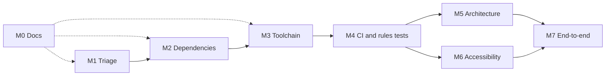

# Roadmap

The work is ordered so each milestone starts from a base that already passes `npm run verify`. A milestone is done when its checkpoint has an observation, not when the code compiles.

**Today:** `master` is on Angular 22.0.5, `@angular/fire` 20.0.1, and TypeScript 6.0.3. On Node 24.20.0, `npm ci` installs the tree. `npm run lint` reports 0 errors and 12 warnings. `npm run build` writes `dist/firebase-example-app` and warns that Sass `@import` is deprecated. `npm test` runs 73 specs in ChromeHeadless and all 73 pass. `ng test` warns that the `@angular-devkit/build-angular:karma` builder is deprecated. `npm ls` exits 0 with one `firebase` (12.15.0): an override maps AngularFire's `firebase` onto the root. Until that override, AngularFire's nested `firebase` 11.10.0 broke every live list query in the browser. `npm audit` reports 63 vulnerabilities: 6 critical, 33 high, 22 moderate, 2 low. `firestore.rules` limits every path under `users/{userId}` to that user, and no test proves it. Fifteen Dependabot security PRs and [#57](https://github.com/SDS37/firestore-angular-example/pull/57) are open. No CI check runs on any of them. The root README is a runbook, and `docs/` holds the requirements, architecture, ADRs, and standards. The hosted app serves `master` since the deploy of 2026-10-09; before that it served a 2019 build.

| Milestone | Status | Goal | Stories | Checkpoint |
|---|---|---|---|---|
| [M0](https://github.com/SDS37/firestore-angular-example/issues/79) | Done (2026-10-09) | Documentation a colleague can run from | FAE-001–FAE-005 | A colleague can install, run, test, and deploy from the docs without asking which file owns the Firebase config |
| [M1](https://github.com/SDS37/firestore-angular-example/issues/85) | Not started | Repository triage | FAE-010–FAE-011 | The only open PRs are Dependabot PRs that M2 supersedes. No config for products the app does not use |
| [M2](https://github.com/SDS37/firestore-angular-example/issues/88) | Not started | Dependencies on the latest stable versions that work together | FAE-020–FAE-023 | `npm ls` reports no invalid package. `npm audit --omit=dev` reports no critical or high. `npm run verify` passes |
| [M3](https://github.com/SDS37/firestore-angular-example/issues/93) | Not started | Build and test toolchain | FAE-030–FAE-033 | No deprecated-builder or Sass warning. The app compiles with `strict` and `strictTemplates` |
| [M4](https://github.com/SDS37/firestore-angular-example/issues/98) | Not started | CI, Dependabot config, rules tests, deploy | FAE-040–FAE-043 | A PR cannot merge without a green `verify` check, and the rules tests run in it |
| [M5](https://github.com/SDS37/firestore-angular-example/issues/103) | Not started | Architecture and data integrity | FAE-050–FAE-053 | Logging out and in as another user, without a reload, shows only that user's data. Deleting a meal leaves no dangling schedule entry |
| [M6](https://github.com/SDS37/firestore-angular-example/issues/108) | Not started | Accessibility, SEO, and PWA | FAE-060–FAE-061 | A keyboard-only user can assign a meal, pinch zoom works, a current Lighthouse report is in the README |
| [M7](https://github.com/SDS37/firestore-angular-example/issues/111) | Not started | End-to-end tests on the emulators | FAE-070–FAE-071 | CI runs the e2e suite against the Auth and Firestore emulators on every PR |

Dotted lines mean "runs alongside". M0 is done, but its documents stay current: each of M1–M3 updates the README **Today** paragraph and the documents it touches. M5 and M6 can run in parallel once CI exists.

## Stories inside the milestones

Use these ids in branch names, commits, and PR titles.

| Id | Milestone | Work |
|---|---|---|
| [FAE-001](https://github.com/SDS37/firestore-angular-example/issues/80) | M0 | Root README is a runbook |
| [FAE-002](https://github.com/SDS37/firestore-angular-example/issues/81) | M0 | Docs index, business and technical requirements |
| [FAE-003](https://github.com/SDS37/firestore-angular-example/issues/82) | M0 | Architecture and architecture decision records |
| [FAE-004](https://github.com/SDS37/firestore-angular-example/issues/83) | M0 | Code standards and commit convention |
| [FAE-005](https://github.com/SDS37/firestore-angular-example/issues/84) | M0 | Roadmap and Definition of Done |
| [FAE-010](https://github.com/SDS37/firestore-angular-example/issues/86) | M1 | Review, rebase, and merge [#57](https://github.com/SDS37/firestore-angular-example/pull/57) (standalone components) |
| [FAE-011](https://github.com/SDS37/firestore-angular-example/issues/87) | M1 | Remove dead configuration |
| [FAE-020](https://github.com/SDS37/firestore-angular-example/issues/89) | M2 | One Firebase SDK version |
| [FAE-021](https://github.com/SDS37/firestore-angular-example/issues/90) | M2 | Angular 22.2 |
| [FAE-022](https://github.com/SDS37/firestore-angular-example/issues/91) | M2 | Tooling on current majors |
| [FAE-023](https://github.com/SDS37/firestore-angular-example/issues/92) | M2 | Audit clean-up and Dependabot PRs closed |
| [FAE-030](https://github.com/SDS37/firestore-angular-example/issues/94) | M3 | Builders move to `@angular/build` |
| [FAE-031](https://github.com/SDS37/firestore-angular-example/issues/95) | M3 | Vitest replaces Karma and Jasmine |
| [FAE-032](https://github.com/SDS37/firestore-angular-example/issues/96) | M3 | Sass `@use` instead of `@import` |
| [FAE-033](https://github.com/SDS37/firestore-angular-example/issues/97) | M3 | Strict TypeScript and strict templates |
| [FAE-040](https://github.com/SDS37/firestore-angular-example/issues/99) | M4 | GitHub Actions verify on every PR |
| [FAE-041](https://github.com/SDS37/firestore-angular-example/issues/100) | M4 | Grouped Dependabot updates |
| [FAE-042](https://github.com/SDS37/firestore-angular-example/issues/101) | M4 | Firestore rules tested on the emulator |
| [FAE-043](https://github.com/SDS37/firestore-angular-example/issues/102) | M4 | Preview and production deploys |
| [FAE-050](https://github.com/SDS37/firestore-angular-example/issues/104) | M5 | Typed store that resets on logout |
| [FAE-051](https://github.com/SDS37/firestore-angular-example/issues/105) | M5 | Failed writes show a message |
| [FAE-052](https://github.com/SDS37/firestore-angular-example/issues/106) | M5 | Schedule references meals and workouts by id |
| [FAE-053](https://github.com/SDS37/firestore-angular-example/issues/107) | M5 | Root-provided services instead of `forRoot` modules |
| [FAE-060](https://github.com/SDS37/firestore-angular-example/issues/109) | M6 | Accessibility fixes |
| [FAE-061](https://github.com/SDS37/firestore-angular-example/issues/110) | M6 | Metadata, manifest, and fonts |
| [FAE-070](https://github.com/SDS37/firestore-angular-example/issues/112) | M7 | Happy path in Playwright |
| [FAE-071](https://github.com/SDS37/firestore-angular-example/issues/113) | M7 | Isolation and failure paths in Playwright |

## Dependency targets

The rule: every package moves to the newest stable version that all of its peers accept. When a peer range blocks a newer major, the package stays and the reason is recorded here and in an ADR. Versions were read from the npm registry on 2026-10-08.

| Package | Today | Target | What limits it |
|---|---|---|---|
| `@angular/*` framework | 22.0.5 | 22.2.1 | Latest 22.x. Closes the advisories on `core`, `compiler` (< 22.1) and `router` (< 22.2) |
| `@angular/cli` | 22.0.5 | 22.2.2 | Latest 22.x |
| `@angular/cdk`, `@angular/material` | 22.0.3 | 22.2.2 | Latest 22.x |
| `@angular-devkit/build-angular` | 22.0.5 | removed | Replaced by `@angular/build` 22.2.2 (FAE-030) |
| `@angular/fire` | 20.0.1 | 20.1.0 | Latest stable. Declares Angular `^20`; `overrides` map it onto Angular 22. `21.0.0-rc.1` declares Angular `^21.2` |
| `firebase` | 12.15.0, one copy | 12.19.x, one copy | `13.0.0` was published 2026-10-07. No AngularFire release accepts it. `@angular/fire` 20.1.0 depends on `^11.8.0`; `overrides` map it onto 12 |
| `rxfire` | 6.1.0 | 6.2.0 | Peer accepts `firebase` `^9`–`^12` |
| `rxjs` | 7.8.2 | 7.8.x | `@angular/fire` peer `~7.8.0` |
| `zone.js` | 0.16.2 | 0.16.3 | `@angular/core` peer `~0.15.0 \|\| ~0.16.0` |
| `typescript` | 6.0.3 | 6.0.x | `7.0.2` is latest. `@angular/build` accepts `>=6.0 <6.1`; `typescript-eslint` accepts `<6.1.0` |
| `eslint` | 9.39.4 | 10.x | `angular-eslint` 22.5.0 and `typescript-eslint` 8.71.1 accept `^10`. Fall back to 9.39.x if a plugin rejects it |
| `angular-eslint` and `@angular-eslint/*` | 22.0.0 | 22.5.0 | Latest |
| `typescript-eslint` | 8.62.1 | 8.71.1 | Latest |
| `firebase-tools` | 14.27.0 | 15.x | `@angular/fire` peer `^14.0.0 \|\| ^15.0.0` |
| `@types/node` | 22.20.0 | 24.x | Matches the Node major in `.nvmrc` |
| Node (`.nvmrc`) | 22.22.3 | 24 | `engines` already allows `^24.15.0` |
| `karma`, `karma-*`, `jasmine-core`, `@types/jasmine` | 6.4.4, 5.6.0, 5.1.15 | removed | Replaced by Vitest (FAE-031) |
| `vitest` | — | 5.x | `@angular/build` 22.2.2 peer `^4.0.8 \|\| ^5.0.0` |
| `jsdom` | — | 30.x | Vitest test environment |
| `@playwright/test` | — | 1.64.x | Latest (FAE-070) |

## Checkpoint questions

At the end of every milestone, answer:

1. Can a colleague clone, install, run, and test the app from the README alone?
2. Does `npm run verify` pass in CI, not only on one laptop?
3. Did a failure path get proved (another user, a rejected write, an unknown route), or only the sunny path?
4. Does any component now call Firestore directly, or any service render UI?

## Time-control rules

- M2 does not start until [#57](https://github.com/SDS37/firestore-angular-example/pull/57) is merged or closed.
- Angular packages move together, in one commit. Never merge a PR that bumps one `@angular/*` package alone.
- Do not install `firebase` 13 until an AngularFire release accepts it. Do not install TypeScript 7 until `@angular/build` accepts it.
- No `npm audit fix --force` and no `legacy-peer-deps`. A peer conflict is solved with an explicit `overrides` entry and an ADR.
- Each story is one PR. A PR that upgrades dependencies and also refactors a component is two PRs.
- Do not add features: no new pages, no social login, no NgRx, no GraphQL. Those ideas from the old README checklist stay out of this roadmap.

After the [Definition of Done](DoD.md), anything else is a new roadmap.
